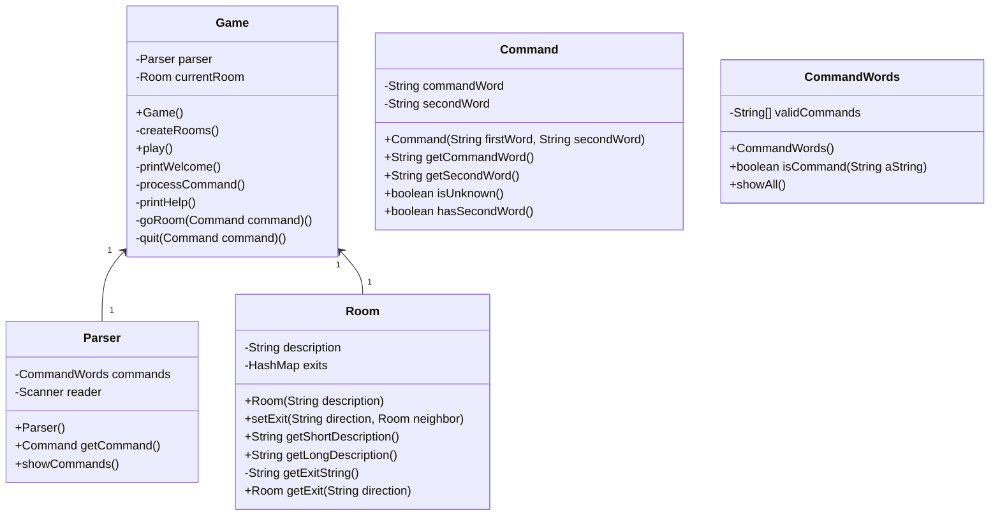

## 样例工程的代码结构分析
UML图如下：



## 维护样例工程
### 1. processCommand()中if语句臃肿问题
在Game类的processCommand()方法中，当用户输入的命令被辨认出来以后，有一系列的if语句用来分派程序到不同的地方去执行。从面向对象的设计原则来看，这种解决方案不太好，因为每当要加入一个新的命令时，就得在这一堆if语句中再加入一个if分支，最终会导致这个方法的代码膨胀得极其臃肿。

> **解决方案：**
> 这里可以采用面向对象中接口继承的思想。为命令统一设定一个接口，然后每条命令都单独用一个类来实现该接口中定义好的执行命令的方法。
> 
> 在C++中，可以使用虚基类来定义这个接口，然后使用哈希表（unordered_map），保存命令和命令类的关系。在Game类中的processCommand()中，定义一个关于基类的指针。然后使用动态联编的方法，在运行时根据哈希表中存储的内容对指针赋派生类（即命令类）的地址。
> 
> 这样，我们每增加一个命令，只需要增加这个命令对应的类，并修改命令哈希表即可，不需要再修改game类了。
> 
> 这里由于Java中没有友元类，无法在Game和CommandWords类中共享信息，故我使用子类的方式，在Game为每个命令创建了一个处理的子类，子类继承自一个公共的接口。
> 这里采用了一个哈希表存储命令和他对应的类。为了不在CommandWords中重复存储信息，我改造了该类和Parser类，使用两个类的构造函数传递了该哈希表。
> 
> 接口类的定义如下：
> ```java
> public interface CommandBaseImpl {
>     public void runCommand(Command command);
> }
> ```
> 同样，CommandWords类要对应修改方法的实现：
> ```java
> public void showAll() {
>     for(Map.Entry<String, CommandBaseImpl> command: commands.entrySet()){
>         System.out.print(command.getKey() + " ");
>     }
>     System.out.println();
> }
> ```
> 最后，还对quit命令单独处理，因为涉及到processCommand()方法返回值的问题。最终该方法的实现如下：
> ```java
> private boolean processCommand(Command command) {
>     if (command.isUnknown()) {
>         System.out.println("I don't know what you mean...");
>         return false;
>     }
> 
>     // 单独处理退出命令
>     if (command.getCommandWord().equals("quit")) {
>         if (command.hasSecondWord()) {
>             System.out.println("Quit what?");
>             return false;
>         } else {
>             return true;  // signal that we want to quit
>         }
>     }
> 
>     CommandBaseImpl commandHandler = commands.get(command.getCommandWord());
>     commandHandler.runCommand(command);
>     return false;
> }
> ```

### 2. 房间信息问题
根据样例工程，所有的房间信息都需要在createRoom中创建，以后每次修改房间都要修改代码并重新编译。这种设计很不方便修改游戏。

> **解决方案：**
> 这里可以采用XML文件的形式存储房间信息，每次运行时读取XML文件来动态创建房间。
> 
> 我引入了一个XMLParser类，用于读取XML文件。然后修改Game类中的createRooms()方法的代码，改为动态创建房间。
> 
> 其中，room.xml文件中一个房间的示例如下：
> ```xml
>     <room id="1">
>         <room_name>outside</room_name>
>         <description>outside the main entrance of the university</description>
>         <north></north>
>         <east>2</east>
>         <south>4</south>
>         <west>3</west>
>     </room>
> ```
> Game类的构造函数负责初始化XMLParser，然后在createRooms()方法中使用XMLParser解析的信息来构建room哈希表，room哈希表的定义如下：
> ```java
> rooms = new HashMap<Integer, Room>();
> ```
> createRooms()方法中先遍历整个XML，创建所有的room对象，然后再重新遍历XML，构造房间之间的位置关联信息。具体过程这里不再赘述。

## 功能扩充
### 1. 房间物件
扩展游戏，使得一个房间里可以存放任意数量的物件，每个物件可以有一个描述和一个重量值，玩家进入一个房间后，可以通过“look”命令查看当前房间的信息以及房间内的所有物品信息。
> **解决方案：**
> 首先设置一个Item类，该类中应有以下元素
> ```java
> private int itemID;
> private int itemRoomID;
> private String itemName;
> private int itemWeight;
> ```
> 还要创建对应的items.xml文件，用于保存每个物品的信息，其中一个物品的示例如下：
> ```xml
> <item id="1">
>     <item_name>stone</item_name>
>     <item_room_id>1</item_room_id>
>     <item_weight>10</item_weight>
> </item>
> ```
> 关于该XML文件的操作，与前文所说Room类似，这里不再赘述
> 
> 还要在Room类中中定义一个ArrayList，用于存储该房间中的所有物品。
> 
> 此外还需创建一个look命令，用于查看房间内的物品，其实现函数如下：
> ```java
> private void look(){
>     if(currentRoom.getItems().size() == 0) {
>         System.out.println("There are no items in the current room!");
>     }
>     else {
>         System.out.println("Items in the current room:");
>         int num = 0;
>         for (Item item : currentRoom.getItems()) {
>             num++;
>             System.out.println(num + ". " + item.getItemName() + " (Weight: " + item.getItemWeight() + ")");
>         }
>     }
> }
> ```

### 2. 实现back命令
这里将扩展要求的2.3合并并进行扩展，直接实现一个高级版本的back命令，使之可以根据用户输入的层数进行回退。
> **解决方案：**
> 要实现历史记录功能并不难，只需要一个保存房间的栈即可。在切换房间时将上一个访问的房间入栈，执行back命令时出栈即可。
> 
> 由于允许用户输入要回退的层数，故这里需要仔细判断用户的输入是否合法。既是合法的数字，大小又不能超过栈的大小。此外，为了更好的用户体验，当用户只输入back命令时，应该自动按照回退1层处理。
> 
> 实现的back函数如下：
> ```java
>     private void back(Command command) {
>         int goStep;
> 
>         // 处理输入的命令，获取要返回几步
>         if (command.hasSecondWord()) {
>             try {
>                 goStep = Integer.parseInt(command.getSecondWord());
>                 if (goStep < 1) {
>                     System.out.println("Wrong step! Back step must bigger than 1!");
>                     return;
>                 }
>             } catch (Exception e) {
>                 System.out.println("Wrong command! Back step must be an integer!");
>                 return;
>             }
>         } else {
>             if(visitRoomHistory.empty()){
>                 System.out.println("You have no room to back!");
>                 return;
>             }
>             goStep = 1;
>         }
> 
>         // 判断能否回退
>         if(goStep > visitRoomHistory.size()){
>             System.out.println("Wrong step! Back step must smaller than the number of rooms visited!");
>             return;
>         }
> 
>         // 执行回退
>         while (goStep > 0){
>             goStep--;
>             currentRoom = visitRoomHistory.peek();
>             visitRoomHistory.pop();
>         }
> 
>         // 输出最后的房间
>         System.out.println(currentRoom.getLongDescription());
>     }
> ```

### 3. 随机传送房间
增加一种房间类型，每当玩家进入这个房间，就会被随机地传输到另一个房间
> **解决方案：**
> 在rooms.xml文件中增加一个字段：<is_random_room>1</is_random_room>即可。
> 
> 然后还需要在Room类增加对应的属性，并Game类的createRoom()方法中保存该属性。
> 
> 最后就是修改go命令的代码，增加一个判断，如果nextRoom具有random属性，则随机换一个nextRoom并告诉用户。相关代码如下：
> ```java
> if (nextRoom.getIsRandomRoom()) {
>     System.out.println("You choosed a random room, next room will be random!");
>     Random random = new Random();
>     List<Integer> keys = new ArrayList<Integer>(rooms.keySet());
>     int randomKey = keys.get(random.nextInt(keys.size()));
>     nextRoom = rooms.get(randomKey);
> }
> ```

### 4. 增加Player类
这部分比较复杂，在增加Player类后，还增加了很多对应的操作。

#### 4.1 Player类的基本定义
在游戏中新建一个独立的Player类用来表示玩家，一个玩家对象应该保存玩家的姓名等基本信息，也应该保存玩家当前所在的房间。玩家可以随身携带任意数量的物件，但随身物品的总重量不能操过某个上限值。
> **解决方案：**
> 已知Player要可以携带物品，故Player类中除了保存一些基本信息外，还要保存携带的物品信息。类成员如下：
> ```java
>     private String playerName;
>     private int currentRoomID;
>     private Room currentRoom;
> 
>     private ArrayList<Item> itemHolded;
>     private int currWeight;
>     private int totalWeight;
> ```
> 然后还要对这些基本信息设置一些getter和setter。
> 
> 其中currWeight由本类进行维护，不对外部暴露。这部分相关代码如下：
> ```java
> public boolean addItem(Item item) {
>     if (this.currWeight + item.getItemWeight() <= this.getTotalWeight()) {
>         itemHolded.add(item);
>         currWeight += item.getItemWeight();
>         return true;
>     } else {
>         return false;
>     }
> }
> 
> public void removeItem(int itemNum) {
>     currWeight -= itemHolded.get(itemNum).getItemWeight();
>     itemHolded.remove(itemNum);
> }
> ```

#### 4.2 look和item命令
在游戏中增加一个新的命令“items”, 可以打印出当前房间内所有的物件及总重量，以及玩家随身携带的所有物件及总重量。
> **解决方案：**
> 这里要新增一个item命令，由于其和look命令有重复的部分，故将重复的部分提取出来。
> ```java
> private void look() {
>     System.out.println(player.getCurrentRoom().getLongDescription());
>     printRoomItems();
>     if (player.getCurrentRoom().isHasMagicCookie()) {
>         System.out.println("This room has a magic cookie!");
>     }
> }
> 
> private void printRoomItems() {
>     if (player.getCurrentRoom().getItems().size() == 0) {
>         System.out.println("There are no items in the current room!");
>     } else {
>         System.out.println("Items in the current room:");
>         int num = 0;
>         for (Item item : player.getCurrentRoom().getItems()) {
>             num++;
>             System.out.println(num + ". " + item.getItemName() + " (Weight: " + item.getItemWeight() + ")");
>         }
>     }
> }
> 
> private void item() {
>     printRoomItems();
>     if (player.getItems().size() == 0) {
>         System.out.println("You do not have any items!");
>     } else {
>         System.out.println("Items with you:");
>         int num = 0;
>         for (Item item : player.getItems()) {
>             num++;
>             System.out.println(num + ". " + item.getItemName() + " (Weight: " + item.getItemWeight() + ")");
>         }
>     }
> }
> ```

#### 4.3 take和drop命令
在游戏中增加两个新的命令“take”和“drop”，使得玩家可以拾取房间内的指定物品或丢弃身上携带的某件或全部物品，当拾取新的物件时超过了玩家可携带的重量上限，系统应给出提示。
> **解决方案：**
> 这两个命令比较类似，都需要判断用户的输入是否合法，并进行相应的操作。
> 
> 其中take命令需要将物品添加到用户当前的持有中，并从房间中删掉该物品。在拾取物品时，还要判断player类中addItem()方法的返回值，分别处理Player是否超重的问题。完整代码如下：
> ```java
> private void take(Command command) {
>     // 处理输入的命令，获取拿哪个东西
>     if (command.hasSecondWord()) {
>         try {
>             int takeNum;
>             takeNum = Integer.parseInt(command.getSecondWord());
>             if (takeNum < 1 || takeNum > player.getCurrentRoom().getItems().size()) {
>                 System.out.println("Wrong num! Num invalid!");
>                 return;
>             }
>             Item takeItem = player.getCurrentRoom().getItems().get(takeNum - 1);
>             if (player.addItem(takeItem)) {
>                 player.getCurrentRoom().getItems().remove(takeNum - 1);
>                 System.out.println("Success take the " + takeItem.getItemName() + "!");
>             } else {
>                 System.out.println("Failed to take the " + takeItem.getItemName() + "! Your bag is full!");
>             }
>         } catch (Exception e) {
>             System.out.println("Wrong num! Num must be an integer!");
>         }
>     } else {
>         System.out.println("You should input the num of item you want to take!");
>     }
> }
> ```
> 而drop则只需要判断输入合法后，便可以将物品取出用户的背包，放在当前房间里。与take不同部分的代码如下：
> ```java
>             Item removedItem = player.getItems().get(takeNum - 1);
>             player.removeItem(takeNum - 1);
>             player.getCurrentRoom().addItem(removedItem);
>             System.out.println("Success to drop the " + removedItem.getItemName() + "!");
> ```

#### 4.4 Magic Cookie功能
在某个或某些房间中随机增加一个magic cookie（魔法饼干）物件，并增加一个“eat cookie”命令，如果玩家找到并吃掉魔法饼干，就可以增长玩家的负重能力。
> **解决方案：**
> 这里首先要做的是修改rooms.xml文件，保存这一信息。这过程与前文随机传送部分类似，这里不再赘述。
> 
> 然后就是吃饼干的逻辑了。当房间里有饼干时，每吃一个可以增加5个单位的重量。相关代码如下：
> ```java
> private void eat() {
>     if (player.getCurrentRoom().isHasMagicCookie()) {
>         player.getCurrentRoom().setHasMagicCookie(false);
>         player.setTotalWeight(player.getTotalWeight() + 5);
>         System.out.println("You have ate a magic cookie, now your total weight is " + player.getTotalWeight());
>     } else {
>         System.out.println("This room does not have anything to eat!");
>     }
> }
> ```

### 5. 数据库功能
这部分的目标是保存当前游戏进度，并允许用户加载该进度。
> **解决方案：**
> 我选择使用Sqlite数据库，为此，新创建了一个DB类，用于维护数据库连接，保存或加载数据。
> 
> 保存功能使用save指令，需要先清空数据库中已有的数据，再重新创建数据。这里我使用DROP IF命令和CREATE TABLE命令。数据库中分三个表，分别保存了房间，物品和玩家信息。
> 
> 在重新创建表之后，我们使用INSERT语句插入命令。这里选择了预编译SQL的方法，既提高了执行速度，还避免了SQL注入。
> 
> 以rooms房间信息表为例，创建表的基本步骤如下：
> ```java
> stmt = conn.createStatement();
> stmt.executeUpdate("DROP TABLE IF EXISTS rooms;");
> stmt.executeUpdate("CREATE TABLE rooms(" +
>         "id int primary key, " +
>         "roomName text, " +
>         "roomDes text, " +
>         "isRandomRoom int, " +
>         "hasMagicCookie int, " +
>         "northExit int, " +
>         "southExit int, " +
>         "eastExit int, " +
>         "westExit int" +
>         ");");
> ```
> 插入数据部分，具体思路是先遍历系统中所有房间，对于每个房间，先将其基本信息保存到rooms表，然后再将其物品保存在items表。之后遍历Player类中的物品，及用户持有的，将这部分物品再保存在items表。最后保存player表，即玩家的基本信息。
> 
> 恢复功能使用load指令，参考Game类初始化的方式。游戏中不单独保存Item列表，物品都存在房间和玩家信息中。故这里需要先读取rooms房间表，然后读取players表。最后保存所有的物品到房间或玩家中。
>
> 这部分的代码很多都是操作数据库，详见DB类。
> 
> 最后对系统流程进行了一些优化，使游戏启动时候默认先从数据库加载历史数据。如果用户执行init命令，则再从XML得到初始数据并重新初始化游戏。

### 6. 多玩家
对系统进行更改，使之能够保存多个玩家的游玩信息，并进行玩家的创建、切换、删除等。
> **解决方案：**
> Game类中需要增加addplayer，delplayer，listplayer，switch命令。得益于Player类的设计，本部分主要是操作数据库，对游戏本体修改不大。
> 
> 首先要修改item表，使之能区分保存的地点。相关代码如下：
> ```java
> stmt.executeUpdate("DROP TABLE IF EXISTS items;");
> stmt.executeUpdate("CREATE TABLE items(" +
>         "id int , " +
>         "itemName text, " +
>         "itemWhere int, " +
>         "itemRoomID int, " +
>         "itemPlayerName text, " +
>         "itemWeight int" +
>         ");");
> ```
> 然后修改保存的代码，在保存时候不删除Player表，而是更新Player表信息，以及需要对表结构进行一些适应性的修改。
> 再然后修改读取的代码，主要是设计player的时候要读取player表中的lastLogin字段来确定当前是哪个用户。
> 
> 然后就是关于Player的操作了，先从DB类入手。在该类中实现addPlayer()，switchPlayer()，getPlayerList()，delPlayer()方法。
> 其中switchPlayer()方法需要先获取用户信息，填充用户对象后还要将player表中的lastLogin字段设置为当前用户。部分代码如下：
> ```java
> // 寻找用户，填充player
> PreparedStatement pstmt = conn.prepareStatement("SELECT * FROM player WHERE playerName = ?;");
> pstmt.setString(1, playerName);
> ResultSet rs = pstmt.executeQuery();
> while (rs.next()) {
>     player = new Player();
>     player.setPlayerName(playerName);
>     player.setCurrentRoomID(rs.getInt("currentRoomID"));
>     player.setCurrWeight(rs.getInt("currWeight"));
>     player.setTotalWeight(rs.getInt("totalWeight"));
>     player.setCurrentRoom(rooms.get(rs.getInt("currentRoomID")));
> 
>     // 设置用户状态
>     Statement stmt = conn.createStatement();
>     stmt.executeUpdate("UPDATE player SET lastLogin = 0;");
>     pstmt = conn.prepareStatement("UPDATE player SET lastLogin = 1 WHERE playerName = ?;");
>     pstmt.setString(1, playerName);
>     pstmt.executeUpdate();
>     conn.commit();
> }
> ```
> 
> 删除用户时要判断当前用户是否持有物品，不能删除持有物品的用户，否则会导致物品丢失。此外，由于删除后会将当前用户置为null，故还要对应命令识别部分，拒绝执行需要player完成的操作。
> 
> 剩余方法都是简单的增删改查，这里不再赘述。
> 
> 最后还要修改Game类，增加这些操作。Game类中的操作只需要负责与用户交互，然后调用DB类即可。

## 测试
这里主要使用单元测试的方式，测试自己添加的两个类：DB和Player和Game类中部分新增的命令。

### 1. Player类测试
自动生成的getter和setter不需要测试，我们只需要测试Player类中的setCurrentRoom()方法和addItem()方法。

setCurrentRoom()方法中，会自动设置Player类中保存的RoomID，故判断RoomID即可。

addItem()方法会判断背包容量，故测试当超容量时，该方法是否返回False即可。

> **测试成果：**
> 全部成功

### 2. DB类测试
该类主要是数据库操作类。在该测试中，我们先定义了一些简单的数据，然后将数据保存在数据库中。

然后分别测试读取数据库中的三类数据，Room、Player和Item。查看能否正确读取即可。

> **测试成果：**
> 在该测试中，我们发现DB类没有设置析构函数，故会造成数据库连接没有正确释放的问题。在手动测试游戏时，Java进程退出后操作系统会自动释放，所以没有遇到这个问题。
> 
> 修改方案：DB类中创建一个析构函数，析构函数中关闭数据库的连接。
> 
> 结果：通过全部测试

### 3. Game类测试
这里主要是对Game类添加的操作做一些简单的测试。为了方便测试，我修改了一下Game类，为player和commands设置了getter函数，用于读取玩家信息，执行命令。

我主要测试了Go/Back、Take/Drop以及Eat命令。

> **测试成果：**
> 全部成功
>

## 其他说明
### 1. 版本管理
本实验中使用了Git进行版本管理，远程库位于[https://github.com/wutcst/sept-person-task-epis2048](https://github.com/wutcst/sept-person-task-epis2048 "https://github.com/wutcst/sept-person-task-epis2048")中。
实验中每个步骤都进行了提交。

### 2. 项目依赖管理
本实验使用Moven进行项目依赖和配置管理，Moven配置文件见根目录下pom.xml。

### 3. 软件编码规范
本实验使用Google开源项目的CodeStyle配置文件配置IDEA开发环境，并自动格式化代码。在自动格式化之外，变量命名，注释等也遵循Google开源项目风格指南以及我自己的命名逻辑。
